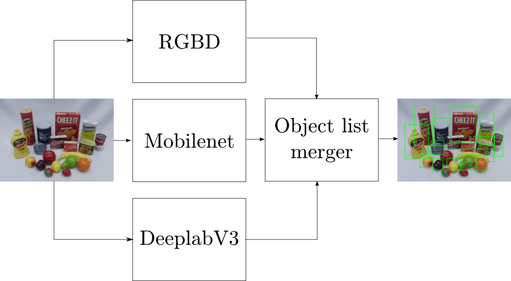

# Probabilities : They dont work as expected

The object list merger was deployed on the robot. Based on different observations we finally selected 2 modalities to be delpoyed 
on the robot.
1. RGB-D sensor
2. RGB wideangle sensor

Based on the 2 modalities we used 3 different algorithms were used for object detection and recognition
1. RGB-D-Based Features for Recognition of Textureless Objects[1]
2. DeeplabV3 [2]
3. Mobilenet [3]

The pipeline was working good!!! Sucess !! Now lets put it to use.

## Dataset

We selected the YCB Dataset for testing the pipeline. 

YCB object dataset has 72 objects to be recognized. The detailed list can be found here. 

We trained all the 3 models on the dataset and started testing our pipeline.

So did everything work fine ??

**NOOO !!!**

Soon we found 

https://stats.stackexchange.com/questions/309642/why-is-softmax-output-not-a-good-uncertainty-measure-for-deep-learning-models
